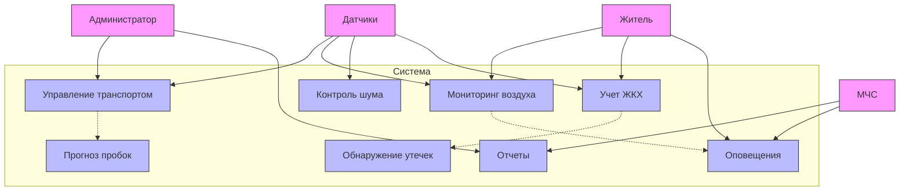

```mermaid
graph TD
    %% Акторы
    A[Администратор]:::actor
    B[Житель]:::actor
    C[Датчики]:::actor
    D[МЧС]:::actor
    
    %% Use Cases
    UC1[Управление транспортом]:::useCase
    UC2[Прогноз пробок]:::useCase
    UC3[Мониторинг воздуха]:::useCase
    UC4[Контроль шума]:::useCase
    UC5[Учет ЖКХ]:::useCase
    UC6[Обнаружение утечек]:::useCase
    UC7[Отчеты]:::useCase
    UC8[Оповещения]:::useCase
    
    %% Связи
    A --> UC1
    A --> UC7
    B --> UC3
    B --> UC5
    B --> UC8
    C --> UC1
    C --> UC3
    C --> UC4
    C --> UC5
    D --> UC7
    D --> UC8
    
    %% Группировка
    subgraph Система
        UC1
        UC2
        UC3
        UC4
        UC5
        UC6
        UC7
        UC8
    end
    
    %% Доп.связи
    UC1 -.-> UC2
    UC3 -.-> UC8
    UC5 -.-> UC6
    
    %% Стили
    classDef actor fill:#f9f,stroke:#333
    classDef useCase fill:#bbf,stroke:#333
    class A,B,C,D actor
    class UC1,UC2,UC3,UC4,UC5,UC6,UC7,UC8 useCase
```
